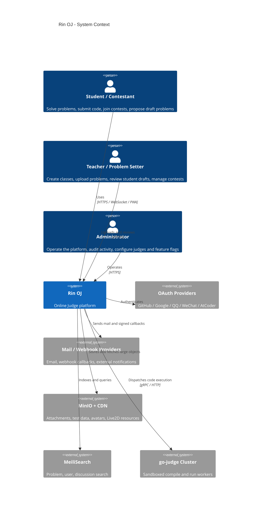

# Rin OJ Architecture

Rin OJ is a modern online judge for schools and community training. The platform targets 1k-10k daily active users, peak 200 submissions per second, 5000+ problems, contests, training plans, and a long 3-5 year evolution window.

## Goals

- Keep architecture extensible before optimizing for short-term speed.
- Define all external HTTP contracts with OpenAPI 3.1 and all internal service contracts with Protobuf/gRPC.
- Keep user, problem, submission, contest, discussion, notification, rating, and judge-dispatcher domains independently replaceable.
- Make teacher and student problem intake simple: uploading a usable problem should feel like a guided form, not a DevOps task.
- Keep the Rin anime-inspired visual layer isolated in `rin-ui` so product UX can evolve without leaking theme decisions into service logic.

## Non-Goals

- Rin OJ will not execute untrusted code in the gateway, frontend, or domain services.
- Rin OJ will not hard-code one judge backend, OAuth provider, rating algorithm, event bus, or theme plugin into core business logic.
- Rin OJ will not proxy large object uploads through the main API; large payloads use MinIO pre-signed URLs.

## Repository Layout

```txt
rin-oj/
├─ apps/
│  ├─ web/
│  ├─ admin/
│  └─ docs/
├─ services/
│  ├─ gateway/
│  ├─ user-service/
│  ├─ problem-service/
│  ├─ submission-service/
│  ├─ contest-service/
│  ├─ discuss-service/
│  ├─ notification-service/
│  ├─ rating-service/
│  └─ judge-dispatcher/
├─ packages/
│  ├─ proto/
│  ├─ openapi/
│  ├─ rin-ui/
│  ├─ sdk-ts/
│  └─ sdk-go/
├─ deploy/
│  ├─ docker-compose.yml
│  ├─ helm/
│  └─ terraform/
├─ docs/
│  ├─ ARCHITECTURE.md
│  ├─ CONTRIBUTING.md
│  └─ adr/
└─ tests/
```

## C4 Context



## C4 Container

```mermaid
C4Container
title Rin OJ - Container View
Person(user, "Student / Teacher / Admin")
System_Boundary(rinoj, "Rin OJ") {
  Container(web, "apps/web", "Next.js 15 + React 19", "Main PWA: problemset, contests, submissions, profile, Problem Intake")
  Container(admin, "apps/admin", "Next.js 15 + React 19", "Admin console: users, problems, judges, reports, audit")
  Container(docs, "apps/docs", "Nextra", "Developer and operator documentation")
  Container(gateway, "gateway", "Go 1.23 + Echo/Fiber", "BFF, OpenAPI HTTP, WebSocket fanout, edge auth")
  Container(userSvc, "user-service", "Go 1.23 + gRPC", "Identity, profile, RBAC/ABAC, OAuth, TOTP")
  Container(problemSvc, "problem-service", "Go 1.23 + gRPC", "Problem metadata, statements, Problem Intake, test data metadata")
  Container(subSvc, "submission-service", "Go 1.23 + gRPC", "Submission lifecycle, status stream, rejudge orchestration")
  Container(contestSvc, "contest-service", "Go 1.23 + gRPC", "Contest lifecycle, registration, scoreboard")
  Container(judgeDisp, "judge-dispatcher", "Go 1.23 + Asynq", "JudgeProvider abstraction, queue consumers, go-judge adapter")
  Container(discussSvc, "discuss-service", "Go 1.23 + gRPC", "Discussions, editorials, comments, moderation hooks")
  Container(notifySvc, "notification-service", "Go 1.23 + gRPC", "Inbox, email, webhooks, subscriptions")
  Container(ratingSvc, "rating-service", "Go 1.23 + Asynq", "RatingAlgorithm jobs")
  ContainerDb(pg, "PostgreSQL 16", "Relational database", "Primary data; submissions partitioned")
  ContainerDb(redis, "Redis 7", "Cache / queue / streams / ZSet", "Asynq, EventBus, leaderboard, rate limit")
  ContainerDb(meili, "MeiliSearch", "Search index", "Chinese, English, Japanese search")
  ContainerDb(minio, "MinIO", "Object storage", "Test data, attachments, avatars, Live2D")
  Container_Ext(gojudge, "go-judge workers", "criyle/go-judge", "Sandbox execution")
}
Rel(user, web, "Uses", "HTTPS / WebSocket")
Rel(user, admin, "Uses", "HTTPS")
Rel(web, gateway, "Calls", "HTTP / WebSocket")
Rel(admin, gateway, "Calls", "HTTP")
Rel(gateway, userSvc, "gRPC")
Rel(gateway, problemSvc, "gRPC")
Rel(gateway, subSvc, "gRPC")
Rel(gateway, contestSvc, "gRPC")
Rel(gateway, discussSvc, "gRPC")
Rel(gateway, notifySvc, "gRPC")
Rel(problemSvc, minio, "Pre-signed upload/download")
Rel(problemSvc, meili, "Index problem documents")
Rel(subSvc, redis, "Enqueue judge tasks", "Asynq")
Rel(judgeDisp, redis, "Consume judge queue and publish events")
Rel(judgeDisp, gojudge, "Run code", "gRPC / HTTP")
Rel(judgeDisp, subSvc, "Stream results", "gRPC")
Rel(contestSvc, redis, "Leaderboard ZSet / PubSub")
Rel(userSvc, pg, "Read/write")
Rel(problemSvc, pg, "Read/write")
Rel(subSvc, pg, "Read/write")
Rel(contestSvc, pg, "Read/write")
```



## Domain Modules

### User and Identity

User-service owns registration, login, email verification, password reset, OAuth account binding, TOTP, profile, follow graph, badges, experience, and Casbin-backed RBAC/ABAC. The gateway validates short access tokens and calls user-service for permission-sensitive decisions.

### Problem and Problem Intake

Problem-service owns problem metadata, multilingual statements, versioned test data, tags, visibility, source, authoring workflow, and the `Problem Intake` experience.

`Problem Intake` is split into two simple flows:

- `Teacher Quick Upload`: a teacher drags in a ZIP or fills one guided form. The ImportWizard extracts `problem.json`, Markdown statements, samples, tests, and optional solutions; validates limits; previews the rendered statement; creates a private draft; and offers one-click publish or submit for admin review.
- `Student Draft Submission`: a student proposes a problem through the same simplified wizard but only gets draft ownership. A teacher or admin reviews, requests changes, imports tests, and promotes it into the official problemset.

The first accepted import format is intentionally plain:

```txt
problem.zip
├─ problem.json
├─ statements/
│  ├─ zh-CN.md
│  ├─ en-US.md
│  └─ ja-JP.md
├─ samples/
│  ├─ 1.in
│  └─ 1.out
├─ tests/
│  ├─ 001.in
│  └─ 001.out
└─ solutions/
   └─ reference.cpp
```

Large test files are uploaded with MinIO pre-signed multipart URLs. The API stores metadata only. Every list uses cursor pagination, never OFFSET.

### Submission and Judge

Submission-service owns submissions, language selection, status transitions, rejudge requests, result aggregation, and WebSocket-visible status. Judge-dispatcher consumes isolated Asynq queues and calls `JudgeProvider`. The default provider wraps `criyle/go-judge`.

### Contest

Contest-service owns contest registration, team support, mode-specific scoring, freeze/unfreeze, virtual participation, scoreboard snapshots, and Redis ZSet-backed real-time ranking.

### Community and Notification

Discuss-service owns discussions, editorials, comments, votes, favorites, reports, and moderation state. Notification-service owns in-app inbox, email, subscriptions, and signed webhook delivery.

## Extension Interfaces

```go
type JudgeProvider interface {
    Submit(ctx context.Context, req JudgeRequest) (<-chan JudgeResult, error)
    Languages(ctx context.Context) ([]JudgeLanguage, error)
    HealthCheck(ctx context.Context) error
}

type AuthProvider interface {
    Name() string
    Begin(ctx context.Context, req AuthBeginRequest) (AuthRedirect, error)
    Complete(ctx context.Context, req AuthCompleteRequest) (ExternalIdentity, error)
}

type RatingAlgorithm interface {
    Name() string
    Compute(ctx context.Context, req RatingRequest) (RatingResult, error)
}

type EventBus interface {
    Publish(ctx context.Context, event EventEnvelope) error
    Subscribe(ctx context.Context, topic string) (<-chan EventEnvelope, error)
}
```

Frontend themes live behind `rin-ui` design tokens and plugin manifests. Remote plugins mount as ESM modules declared by administrators and isolated by capability scopes.

## Event Model

Events are versioned, immutable envelopes:

```json
{
  "id": "evt_01J...",
  "type": "submission.judged",
  "version": 1,
  "occurredAt": "2026-05-02T10:00:00Z",
  "actorId": "usr_...",
  "subjectId": "sub_...",
  "traceId": "trace_...",
  "payload": {}
}
```

Initial event types:

- `user.registered`
- `problem.draft_created`
- `problem.import_validated`
- `problem.published`
- `submission.queued`
- `submission.running`
- `submission.judged`
- `contest.started`
- `contest.scoreboard_frozen`
- `contest.scoreboard_unfrozen`
- `notification.created`

Webhooks subscribe to the same event stream. Delivery uses HMAC signatures and retry with dead-letter storage.

## Performance Rules

- LCP target: under 1.8s on domestic hosting.
- Problem statement API P99: under 80ms.
- Submission API P99: under 150ms.
- Judge dispatch latency from queue to worker: under 200ms.
- Scoreboard updates: under 1s.
- Browser, CDN, Redis, and database caching are layered.
- All list endpoints use cursor pagination.
- Large objects go through MinIO pre-signed URLs.

## Security Rules

- Judge workers must run with cgroup v2 limits, seccomp-bpf, PID/network namespace isolation, tmpfs workdir, read-only rootfs, and no default network.
- Default run limits are CPU 1 core, memory 256MB, wall time 1s, output 64MB, stack 64MB.
- Markdown statement/editorial rendering is sanitized before display.
- API auth uses short access tokens, long refresh tokens, CSRF tokens, and dual-cookie handling.
- Submission source is encrypted at rest. Admin source view requires step-up authentication.

## Observability

All services emit OpenTelemetry traces, Prometheus metrics, and structured logs. The deploy layer will include Grafana dashboards, Loki/Promtail, Jaeger, and Alertmanager routes for Feishu, DingTalk, and Discord.
